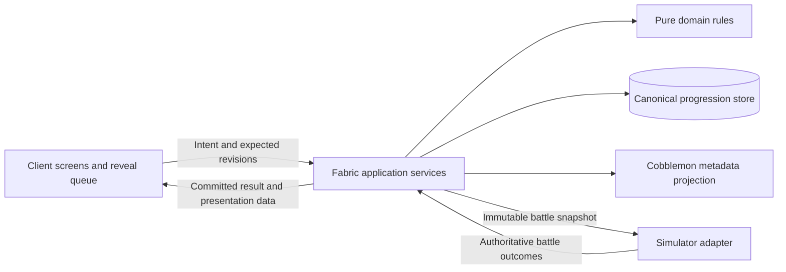

# CobbleAscend — Technical Design Specification

Version 0.1 · 2026-10-03 · Status: implementation plan for review

Target: Minecraft 1.21.1, Fabric, Cobblemon 1.8.1, Java 21. Working product name: CobbleAscend. CobbleRaids integration is explicitly deferred; the standalone release must not depend on it.

This document is the current implementation specification. It consolidates the latest owner decisions and supersedes conflicting rules in the earlier design/economy/architecture drafts. It does not claim the systems below are already implemented. Numerical values labeled provisional require balance approval through testing.

## 1. Requirements and scope

| ID | Requirement | Implementation consequence |
|---|---|---|
| R1 | Captures receive Common through Mythic ascension rarity | Persist one server-generated result per legitimate acquired Pokémon. |
| R2 | Rarity determines ordinary affix capacity | One to six slots; preserve native IVs, EVs, nature, ability and held item. |
| R3 | Every ten levels offers an affix upgrade choice | Pokémon-specific milestone ledger and persistent pending choices. |
| R4 | Player selects the affix to upgrade | Stable slot IDs, rank tables and an explicit confirmation transaction. |
| R5 | Reforge currency uses the selection screen too | Shared screen with distinct Upgrade and Reforge modes; preserve slot rank. |
| R6 | Affixes enable builds, including damage over time | Simulator-side conditions, status attribution and bounded effect composition. |
| R7 | A scarce material adds a powerful Unique affix | One separate Unique slot; player selects an eligible power using a Unique Catalyst. |
| R8 | Captures have suspenseful animation and sound | Client reveal queue; saved result precedes animation; skipping cannot alter outcomes. |
| R9 | Rarity colors follow the provided title art | Silver/cyan/blue/violet/gold; Mythic crimson with silver and white; exclude Collector green. |
| R10 | Develop standalone first | No raid dependencies, private raid hooks or raid-version work in this release plan. |

The accepted Unique design uses crafting, not naturally rolled Unique captures. Unique is a classification in addition to ascension rarity, not a seventh ordinal rarity. Display examples: `Rare · Unique`, `Mythic · Unique`. The existing internal rarity ID `mythical` remains stable; the client displays `Mythic`.

Default combat scope is supported turn-based PvE. Every side in PvP uses native battle rules with all addon effects inactive. Unsupported formats must be identified before entry, not discovered when a move resolves.

## 2. Current code and gaps

| Existing location | Verified foundation | Required development |
|---|---|---|
| `domain/.../Rules.java` | Weighted rarity tickets, base affix validation and catalog parsing | Five rank bands per ordinary affix, eligibility/exclusion rules, catalog versions. |
| `domain/.../Profile.java` | Immutable schema-zero Pokémon profile | Stable ranked slots, milestone accounting, optional Unique, authority/provenance. |
| `domain/.../Progression.java` | Pure create/promote/reforge/refine calculations | Slot-ID operations, rank-aware rolls, upgrades and Unique installation/replacement. |
| `domain/.../Wallet.java`, `RewardPolicy.java` | Pure cost/reward arithmetic and Core pity | Material IDs, Catalyst/fragment balance and durable reward entitlements. |
| `fabric/.../PokemonProfiles.java` | Prototype metadata read/write and dirty notification | Versioned projection, migration and reconciliation with canonical storage. |
| `fabric/.../CobbleAscend.java` | Capture listener, pending ownership check and commands | Persistent acquisition handling, lifecycle adapters, networking and capability checks. |
| `design/affixes.json` | Twelve stored base-affix templates | Rank tables and build-enabling effect definitions; existing file is not a combat engine. |
| Capture preview | Interactive visual concept | Native Minecraft screen, original textures, sound assets and client integration. |

Previous verification: 21 domain tests passed; jar compilation/packaging succeeded; development loader initialized Cobblemon, its Showdown service and the addon before an intentional pre-world stop. No actual capture, battle-affix, trade, PC or restart gameplay verification has been completed. See [BUILD-STATUS.md](BUILD-STATUS.md) for evidence and limitations.

## 3. Architecture and ownership

Keep the existing domain/Fabric split. Add storage and client source boundaries as the first consumers require them; no general scripting framework or cross-platform abstraction is needed.

- **Domain:** validates profiles/catalogs, calculates transitions and produces proposed results. No player lookup, database, renderer or Minecraft dependency.
- **Application services:** verify ownership, coordinate locks, authorize operations and invoke store transactions. All native Pokémon access occurs on the server thread.
- **Progression store:** canonical profiles, wallets, operation results, entitlements and pending presentations. Use embedded SQLite as the selected design; choose and pin its JDBC dependency during implementation.
- **Cobblemon adapter:** capture/level/storage lifecycle signals, Pokémon resolution and namespaced metadata projection. Mutations use the verified dirty-notification call.
- **Battle adapter:** mode classification, validated snapshots, simulator effect registration, participation and outcomes. It must not invent HP changes in a second world-side damage listener.
- **Client:** rendering, input, queues, sound and local preferences. It cannot choose authoritative rarity, rolls, costs, ranks or entitlements.

The exact simulator injection seam remains a spike. Existing packet/interpreter access is not evidence of a general supported affix API. Prefer a supported extension point; otherwise isolate a version-pinned, composable hook behind capability negotiation. Never replace the Pokémon's native ability or held item to encode an affix.

## 4. Production data model

### 4.1 Profile schema 1

| Field | Type / constraints | Meaning |
|---|---|---|
| `schemaVersion` | integer = 1 | Serialization version, separate from content version. |
| `profileId` | UUID | Permanent addon identity. |
| `pokemonId` | UUID | Native Pokémon identity; verified against the resolved subject. |
| `authorityId` | UUID | Owning server/world progression authority. |
| `revision` | positive 64-bit integer | Increment on every committed profile mutation. |
| `rarity`, `initialRarity` | stable rarity IDs | Current and acquisition rarity. |
| `origin` | source kind, optional acquisition ID | Provenance; capture, hatch, legacy, admin or validated external grant. |
| `catalogVersion` | stable content revision/hash | Last validated content definition version. |
| `attunement` | nonnegative integer | Separate promotion progression; not milestone credits. |
| `highestLevelObserved` | integer, normal range 1–100 | Used to catch up milestones without re-awarding old ones. |
| `awardedMilestones` | unique subset of 10,20,…,100 | Permanent milestone awards. |
| `spentUpgradeCredits` | integer 0–10 | Credits invested in ordinary slot ranks. |
| `ordinarySlots` | ordered collection, maximum 6 | Stable slot identities and ordinary affixes. |
| `unique` | nullable `UniqueInstance` | Exactly one crafted Unique power. |

`OrdinarySlot = {slotId, category, rank, affixId, parameters, rolledValue, definitionVersion}`. Slot IDs are permanent, such as `prefix:0` or `suffix:1`; never address a mutating UI list by index. Rank is I–V. Rank belongs to the slot, so changing the affix does not erase level investment. Parameters include a selected move type where needed.

`UniqueInstance = {uniqueId, definitionVersion, installedOperationId}`. Unique powers have fixed individual tuning and no ordinary rank. No rank-up, refine or normal reforge can target this field. Replacement changes the whole instance in one explicit Catalyst transaction.

Core invariants:

1. `pendingCredits = awardedMilestones.size - spentUpgradeCredits`, always nonnegative.
2. `spentUpgradeCredits = sum(slot.rank - 1)` for profiles without a future explicit respec/migration exception.
3. Slot category counts match the current rarity. No ordinary family occurs twice on one Pokémon.
4. Every roll is an integer within that affix's range at that slot's rank.
5. A legitimate Pokémon maps to one canonical profile. Duplicate native/profile identities are quarantined rather than silently rerolled.
6. Unique exists only following a trusted migration/admin action or committed Catalyst transaction, never an ordinary capture rarity draw.

The Unique slot is the sole dedicated special-power slot for launch. This resolves the earlier speculative “signature slot”: there is no second parallel signature system. Build-enabling ordinary affixes can occupy ordinary prefix/suffix slots; exceptional mechanics occupy Unique.

### 4.2 Wallet and ledgers

Replace the three-field production wallet design with `Map<MaterialId, long>` plus a wallet revision. IDs: `resonance_dust`, `facet`, `ascension_core`, `unique_fragment`, `unique_catalyst`. Validate allowed IDs, checked arithmetic and nonnegative balances. Keep the current prototype `Wallet` intact until its callers migrate in one reviewed change.

Materials are account-bound canonical balances for launch. A Catalyst is a crafting material represented in that wallet and by an icon/action in the UI; a physical inventory item is not required. This avoids pretending that inventory removal and SQLite share an atomic transaction. If tangible items are introduced later, they require a separate redemption/escrow specification.

Store tables: profiles, wallets, operations, acquisition intents, milestone awards, reward entitlements, encounter runs, reward-budget reservations, research milestones, pending presentation events and migrations. Use unique keys for `(profileId, milestoneLevel)`, operation ID and `(encounterId, playerId, rewardKind)`.

Battle counters, active status attribution and reveal animation progress are not part of permanent Pokémon metadata.

## 5. Lifecycle and acquisition

### 5.1 Capture

`Observed → OwnershipPending → ProfileCommitted → Projected → RevealPending → Acknowledged`.

Observe the native successful-capture event, then confirm actual ownership/storage. Generate rarity and base-rank affixes once. In the same canonical commit, initialize reached milestones, record acquisition identity and create a reveal event. Project the saved profile to Cobblemon metadata and mark it dirty. Only then notify the recipient.

Repeated callbacks resolve the existing committed profile. A failed insertion creates no owned profile, research payment or capture reveal. Party-to-PC fallback must resolve the exact Pokémon identity, not search by species/nickname.

SQLite and native capture storage are separate durability boundaries. Persist acquisition intent when sufficient event identity exists, and reconcile on store load. A capture saved by Cobblemon before any addon intent is durable may have unknown provenance after a crash; preserve it and route through documented recovery policy, never invent proof that a wild rarity roll was committed. Exact event ordering and store access are runtime acceptance gates.

### 5.2 Level milestones

On authoritative level change or profile reconciliation, compute milestones through `min(observedLevel,100)`. Grant only levels absent from the ledger, in one transaction with the profile revision. The level-change event signature still needs verification; do not use a full-PC scan each tick as a substitute.

- Level 9→10: one credit.
- Level 19→31: two credits.
- First level-37 capture: three pending credits, ordinary slots at rank I.
- First level-100 capture: ten credits.
- Level lowered and restored: no repeated credits.
- XP candy/Rare Candy: ordinary authoritative level gains count; the source of XP is not a restriction.
- Evolution and trading preserve the ledger and credits.

Automatic catch-up means catching a high-level Pokémon also grants its earlier level choices. This is an explicit design choice, not a ten-level-trained-after-capture requirement. Record administrative grants in provenance/audit rather than special-case ordinary level events silently.

### 5.3 Other acquisition paths

Hatched, legacy and unknown/admin Pokémon initialize at Common unless an explicit trusted grant says otherwise; reached milestones still catch up. Existing profiles always retain their rarity and upgrades. Cross-server authority imports are unsupported by default and require an explicit validated import policy. Evolution/form changes preserve profile identity when the native identity survives; test exceptional clone-based evolutions before enabling them.

## 6. Crafting and upgrade contracts

| Operation | Selection | Cost | Committed result |
|---|---|---|---|
| Upgrade | One ordinary slot below V | One pending credit | Same identity/parameters; rank +1; roll in next band. |
| Reforge | One ordinary slot | Configured reforge currency cost | New eligible affix/value at the existing rank. |
| Refine | One ordinary slot | Configured refine currency cost | Same identity/rank/parameters; reroll its value. |
| Promote | Next ascension rarity | Promotion materials + attunement requirement | Add exactly one rank-I slot; retain other state. |
| Install Unique | One eligible named power | One Unique Catalyst | Add the selected fixed Unique power. |
| Replace Unique | One different eligible named power | One Unique Catalyst | Replace the existing power after overwrite confirmation. |
| Assemble Catalyst | Catalyst recipe | Configured fragment threshold | Consume fragments and credit one Catalyst. |

No currency is spent merely by opening a screen or selecting a slot. Reforge and Refine may yield the same or worse value within the current band; previews disclose this. Upgrade bands must strictly increase so upgrading cannot reduce raw magnitude. Unique installation is a choice, not a random roll; its preview shows the full benefit, limitation and eligibility.

### 6.1 Transaction sequence

1. Request preview for an owned Pokémon, operation type and optional slot/Unique ID.
2. Server resolves current owner, profile/wallet revisions, configuration hash, eligibility, cost and possible result ranges.
3. Return a bounded, expiring preview token bound to the player and exact operation. No random final result is revealed before commitment.
4. Confirmation submits token, operation UUID and expected revisions. Server rechecks ownership and locks the Pokémon against battle/trade/crafting while the operation is pending.
5. A single store transaction validates funds/credits, draws any random result once, mutates profile/wallet, increments revisions, records the immutable result and adds a presentation event.
6. Project the committed profile to Cobblemon, notify the client and release the mutation lock. Animation never participates in ownership or spending.

Duplicate operation ID with the same request returns the same result. Reusing it with different parameters is rejected. Crash before commit changes nothing; crash after commit reprojects the committed revision without another debit/draw. A disconnect after valid commit is not a refund. If projection fails, retain a recoverable state and block conflicting mutations until reconciliation; do not report that the transaction never happened.

Preview expiration, unavailable store, stale revision, insufficient balance, invalid slot, battle lock, maximum rank and incompatible Unique each have explicit error codes. A result whose commit status is uncertain displays “Checking your previous craft,” not “nothing was spent.”

## 7. Rank definitions and combat budgets

Each ordinary affix must declare five independently validated bands. Example only: Fire Focus I 4–8%, II 9–12%, III 13–16%, IV 17–20%, V 21–24%. These are not automatically adopted final values. Reforge eligibility excludes families already in other slots and any definition missing the selected rank. Every release definition must support all five ranks.

Represent percentages as integer basis points in the production combat snapshot to support precise bounded effects; display player-friendly percentages. Migrate existing integer-percent rolls by exact multiplication, not re-rolling. Definition quantities distinguish percent bonuses, percent maximum HP, fixed amounts and event counts so they cannot be confused.

The original damage/mitigation/healing caps were for rank-I-only content. Do not enable rank V using those caps without reviewing whether upgrades have useful effects. The balance pass must specify per-channel caps, modifier order and treatment of Unique effects before live combat release. UI previews explain raw improvement, relevant conditions and cap-limited outcomes; they cannot guarantee a particular damage increase against every opponent.

All percentage composition occurs through native simulator conventions, with its rounding, immunities and failure paths retained. Never force a minimum-one bonus through an otherwise immune or blocked hit. Core caps and all values are server-controlled, versioned and frozen per battle.

## 8. Build-enabling affixes

### 8.1 First additional catalog candidates

These effects are selected design candidates, not implemented behavior or final numerical tables. Each gets five bands after its simulator proof. Omit unsafe candidates from available roll pools until ready.

| Affix | Category/family | Hook and bounded behavior |
|---|---|---|
| Smoldering | Prefix / burn potency | Boost native residual damage of burns attributed to the holder; no second status application. |
| Venomous | Prefix / poison potency | Boost attributed regular poison damage. Exclude toxic poison in the first implementation. |
| Affliction Hunter | Prefix / status exploitation | Direct move-damage bonus against a target with a major status; no residual multiplier. |
| Siphoning | Suffix / conditional drain | Additional move-sourced drain healing against afflicted targets; no recursive heal triggers. |
| Relay Guard | Suffix / switch guard | Reduce the first incoming damaging move after a legal switch-in, with a fixed limited activation count. Rank improves magnitude, not activation count. |
| Vengeful | Prefix / retaliation | Surviving opposing direct move damage arms one capped next-move bonus; no stacking charges, multi-hit grants at most one charge per incoming move. |

Weather, trapping, ally recovery and post-switch lingering bonuses follow as separate content increments once the associated hook is tested. Do not promise all illustrative conversation examples in the first slice.

### 8.2 Status attribution

Maintain a battle-local ledger keyed by target battle identity and status instance: source battle identity/profile, status kind, application event ID, turn and immutable source effect snapshot. Record attribution only when the simulator confirms successful application. Existing status without proven source receives native damage only.

Defaults for the first DoT implementation:

- Boost only opposing targets and only the attributed status instance. Failed/redundant applications do not steal attribution or refresh a proc.
- Ordinary potency bonuses operate while the original inflictor is active and not fainted. Switching/fainting removes the bonus but does not cure the native status. A later explicit lingering effect can change this rule.
- Curing, replacement, transfer or battle teardown retires attribution. Status transfer does not copy the original holder's bonuses; unsupported reflected/indirect applications get native behavior until explicitly supported.
- Native immunities, prevention and healing abilities remain authoritative. A modifier changes valid native residual damage once; it never creates damage when the native event was prevented or converted to healing.
- Switching by the afflicted target preserves attribution only if the native status itself persists. Battle-local status state does not survive unrelated battle starts.
- Toxic poison, ally/self-inflicted status, confusion, weather and trap residuals are separate effect kinds, not accidental matches for a generic “damage” hook.

DoT increases apply to native residual damage, not arbitrary percentages independently subtracted from world HP. Boss-specific percentage-health rules are deferred with raid integration. This standalone implementation cannot claim compatibility with external shared-health formats.

## 9. Unique crafting system

### 9.1 Unlock and eligibility

One Unique slot is available on any ascension rarity. Owning a Catalyst provides access; rarity is not an additional gate. The eligibility list may constrain native species/form/type or move compatibility only where required for meaningful behavior, and the screen explains each restriction. Never consume a Catalyst if there are no eligible powers.

Do not silently remove a Unique after evolution/form/move changes. Re-evaluate capability at battle snapshot time; preserve the installed power and show any inactive prerequisite. Prefer broad eligibility to minimize this case.

Launch Unique candidate: **Ashen Heart**. It substantially strengthens holder-attributed burns but reduces direct move damage. Exact multipliers are provisional until the burn attribution spike passes. Its interaction with Smoldering must be explicitly budgeted: use a declared shared residual-damage channel and cap, not accidental unlimited multiplication. Prove this one Unique before shipping a large catalog.

Later candidates include once-per-battle survival, poison-driven ramping and weather activation. Each must define trigger, duration, activation limit, reset behavior, drawbacks, stacking exclusions and native interactions. Unique rank never increases through ordinary milestone upgrades.

### 9.2 Scarcity proposal

Initial test configuration: 100 Unique Fragments assemble one Catalyst; one fragment per eligible full-reward top-rank standalone Trial victory; 1% independent full-Catalyst chance on those same victories. A natural Catalyst does not remove accumulated fragments. Lower ranks, research captures, PvP, defeats, aborted runs and reduced-reward overflow wins grant neither material.

These are starting tuning values, not approved production economy rates. The existing configurable full-reward budget applies. This creates a bounded fragment route while preserving a scarce jackpot. Unique replacements consume a full Catalyst; no salvage/refund loop exists. Reward entitlement uniqueness prevents replayed encounters from multiplying fragments or Catalysts.

Store earned Catalyst/fragment balances with the same atomic reward bundle as other materials and progression. Drop announcements are emitted after commit. No paid purchases or monetization are part of this specification.

## 10. Native client screens and networking

Required screens:

1. `CaptureRevealScreen`: portrait/model, rarity, ordinary affixes and follow-up inspection.
2. `AscensionInspectScreen`: slots/ranks, ranges, Unique power, pending credits and current combat support.
3. `AffixSelectionScreen`: Upgrade, Reforge and Refine modes sharing selection/preview controls.
4. `UniqueCraftScreen`: eligible powers, detailed tradeoffs, material balance and overwrite confirmation.
5. Trial selection/result screens after the standalone encounter slice.

Required message contracts (names proposed; no API implementation claimed):

| Direction | Message | Minimal fields |
|---|---|---|
| C→S | `InspectRequest` | Authorized Pokémon reference, request ID. |
| C→S | `CraftPreviewRequest` | Pokémon ID, operation kind, slot/power ID. |
| S→C | `CraftPreview` | Token/expiry, revisions, content hash, cost, eligible outcomes and ranges, warnings. |
| C→S | `CraftConfirm` | Operation UUID, token, expected revisions. |
| S→C | `CraftResult` | Operation UUID, committed outcome or structured rejection, new sanitized profile/wallet revisions. |
| S→C | `RevealEvent` | Event ID, profile revision, reason, Pokémon display snapshot, saved result, pending-credit count. |
| C→S | `PresentationAck` | Event ID only; acknowledgement has no economic effect. |
| S→C | `Capabilities` | Protocol/content versions, enabled battle modes/effects and disable reasons. |

Use bounded payloads and stable namespaced IDs. Enforce ownership/permissions on the server, validate counts and lengths, rate-limit previews, reject unknown protocol versions and prevent arbitrary opponent/PC data disclosure. Client preferences can change presentation only. Match client/server addon versions for the intended GUI release; no server-only GUI promise.

## 11. Reveal state machine, suspense and audio

`Queued → AwaitSafeScreen → CardArrival → Anticipation → Flip → AffixReveal → Summary → Acknowledged`.

Presentation priority: native battle/move-learning/evolution flows first, then committed capture/crafting reveal, then optional pending-upgrade selection. Never replace an essential native screen. A pending upgrade remains accessible if the player dismisses it.

Proposed timings: arrival 200–300 ms; anticipation scales with rarity; ordinary complete reveal roughly 1–2 seconds, Mythic 3–4 seconds. An immediate Skip shows the saved summary; Continue dismisses it. Neither action spends, rolls, grants or upgrades anything. Distinct rare sounds are original/licensed assets; no music or sounds are assumed reusable merely because a repository is open source.

Sound layers: arrival whoosh/tap, rising anticipation tone, rarity reveal accent, short staggered affix chimes. Mythic uses a brief quiet beat, low impact and silver ringing tail. Avoid overlapping reveal audio when multiple captures queue; stop/fade event-owned sound handles on skip, close, world change or disconnect. Respect Minecraft master volume plus a dedicated reveal-volume setting. Provide reduced motion, optional reduced flash, and compact presentation mode.

Use owner reference palettes in [rarity-colors.json](../design/rarity-colors.json). Mythic = crimson/silver/white, never Collector emerald. A crafted Unique gets an additional `Unique power awakened` reveal after its transaction; it is not a naturally captured seventh rarity color. Begin with the Pokémon's existing rarity frame plus a distinct Unique emblem/title until a separate Unique palette is chosen.

The web preview uses a reference illustration. Native renderer integration must preserve species/form/shiny appearance and use a tested Cobblemon portrait/model hook. Rendering availability is a separate gate from packet delivery.

CobblemonCards is an architectural reference: its booster screen has flip/glow/sound techniques but is coupled to card ItemStacks and booster messages. Create an addon-owned screen and payload. Do not invoke its reward/close pipeline. Any adapted contributed code gets an upstream commit/license provenance note; assets are independently accounted for. See [UX.md](UX.md) for inspected source links.

Persist a bounded recent-presentation history (proposed 100 events/player, 7 days). Deduplicate event IDs. Overflow is represented as a grouped recent-results entry; it never deletes progression. On reconnect, offer unseen results without forcibly replaying an entire backlog. Acknowledgement/replay affects only presentation. Clear client queues when changing servers.

## 12. Catalog validation and compatibility

Versioned definitions must declare: stable ID, category/family, five rank ranges for ordinary affixes, eligibility, effect handler ID, required simulator capability, stacking channel/exclusions, localized description parameters and content revision. Unique definitions additionally declare drawback, trigger limits and no ordinary rank.

Only allow built-in effect handler IDs; content packs do not supply executable JavaScript. Validate replacement catalogs completely before activation. Reject missing ranks, reversed/overlapping upgrade ranges, duplicate IDs, unknown handlers, impossible slot pools, invalid parameter types and excessive values. Existing battles retain their original snapshots on reload.

Missing definitions preserve stored data with an inactive warning. Unknown future schemas block mutations. A numerical rebalance is an explicit content migration with audit/backup and clear versioning, not an unnoticed reroll. Never spend a Catalyst to install an effect the active simulator reports unsupported.

## 13. Migration, backup and recovery

Schema-zero migration reads and validates existing prototype profiles. Preserve IDs, rarity, initial rarity, values and origin. Assign slot IDs deterministically by category in the existing list order, all at rank I. Grant legitimate reached milestones once; spent count starts at zero. Unique starts absent. Record migration operation identity and canonical authority, then project schema 1. Re-running migration must be a no-op.

Changing the stored NBT value from prototype JSON string to the versioned production projection requires an explicit reader for both forms during migration. Preserve invalid source data for operator review; never “repair” it by generating a fresh high-value capture roll.

Backup world data and canonical store together using a consistent save/SQLite backup boundary. An unexpectedly missing/mismatched store stops mutation rather than resetting progression. Document restore and downgrade as matched backup operations. Do not delete metadata or databases when disabling the mod.

## 14. Development work packages

| Order | Work package | Completion gate |
|---|---|---|
| P0 | Reconcile product rules and schemas | This spec, stable vocabulary, rank/Unique schema and acceptance list reviewed. |
| P1 | Ranked domain model | Slot IDs, rank validation, milestones, rank-preserving reforge, Unique transitions; deterministic unit/property tests. |
| P2 | Canonical store and migration | Atomic profile/material/credit changes; operation replay; schema-zero migration; fault-injected recovery. |
| P3 | Lifecycle adapters | Live capture/PC/restart/evolution/trade and level-change tests; no repeated milestone awards. |
| P4 | One-affix simulator spike | Fire Focus modifies native damage correctly; effects disabled uniformly in PvP/unsupported modes. |
| P5 | DoT and first Unique | Proven burn attribution, Smoldering/Ashen Heart interaction and fixed drawbacks; no immunity bypass. |
| P6 | Client crafting and reveals | Shared selection modes, Catalyst choice/overwrite, saved-result animation/audio, reconnect and accessibility behavior. |
| P7 | Standalone earning loop | Real solo Trials, atomic rewards, fragment/Catalyst sources, research/promotion integration and clear unlocks. |
| P8 | Expanded catalog and balance | Rank tables/caps evaluated across representative builds; exact target client/server release matrix. |

P1 can start immediately without waiting for raids or the simulator. P2 precedes any exposed material spending. P4 must pass before promising functional affixes. P5 precedes making Unique Catalysts obtainable in a player economy. Client previews can be built with clearly labeled sample data before those gates, but must not show an unsupported effect as active.

No wall-clock delivery promise is attached to this plan. Simulator and native lifecycle discoveries can change implementation effort; record the proof from each gate before expanding scope.

## 15. Acceptance matrix

| Test | Expected outcome |
|---|---|
| Every rarity, five ranks, type variants | Valid complete slots; rank roll within its definition; family exclusions preserved. |
| 9→10, 19→31, level-37/100 initial acquisition | Exactly the appropriate newly reached milestone credits. |
| Level reduction/regain, replayed event, trade/restart | No duplicate milestones or lost pending choices. |
| Multiple pending upgrades, all existing slots at V | Allocate one at a time; retain unusable credits for future slots. |
| Reforge ranked slot and refine afterward | Slot ID/rank retained; only selected affix/value changes as defined. |
| Promote with pending credits/Unique present | New rank-I slot only; other progression preserved. |
| Install/replace Unique, cancel, incompatible power | Explicit choice and overwrite; exactly one Catalyst spent on valid commit only. |
| Duplicate craft confirmation, concurrent trade/battle | One authorized commit or structured refusal; no double spend. |
| Crash before/after commit and before projection | Correct replay/reconciliation without another roll, credit or debit. |
| Schema-zero migration repeated or interrupted | Existing rolls retained and milestones imported exactly once. |
| Burn source switch/faint/cure/target switch | Bonus follows declared active-source attribution; native status behavior retained. |
| Toxic, immunity, poison-healing ability, reflected status | No accidental bonus or prevention bypass on unsupported event kinds. |
| Multihit, substitute, recoil, drain, critical hit | Native engine ordering respected; no duplicated effect application. |
| PvP or failed simulator capability handshake | Addon combat effects inactive consistently; unsupported crafts rejected. |
| Capture/upgrade/evolution/reveal competing screens | Essential native screen completes first; results/credits remain reachable. |
| Skip/replay/close/reconnect during reveal | Same committed result; no gameplay mutation. |
| Sound disabled/reduced motion/rapid captures | Accessible summary, no overlapping orphan audio or forced flashing. |
| Catalyst drop plus fragment assembly/replayed reward | Independent earned balances retained; no duplicated entitlement. |
| Missing store/catalog, invalid packet, unknown schema | Preserved data, bounded rejection and useful operator diagnostic. |

Use headless domain tests for deterministic rules, transactional integration tests with injected failures for storage, simulator fixtures for damage, and real dedicated-server/client sessions for native lifecycle and UI. A build/loader pass does not replace in-game acceptance.

## 16. Remaining technical decisions and next deliverable

Outstanding proof: exact simulator hook/rounding order; native level-change callback and event ordering; status attribution/transfer hooks; native portrait rendering; standalone NPC Trial execution; persistence projection timing; exact SQLite runtime packaging. Outstanding tuning: all rank tables/caps, Unique strengths/tradeoffs and final Catalyst scarcity. These are bounded work items, not reasons to delay ranked domain work.

**Next deliverable: P1 ranked domain foundation.** Add stable slots, five-band definitions, monotonic milestone accounting, pending-upgrade transitions, rank-preserving reforge/refine and one optional fixed Unique instance. Include migration fixtures and tests before exposing any live currency spending. Keep the current working prototype build available until its replacement passes the same build and loader checks.
